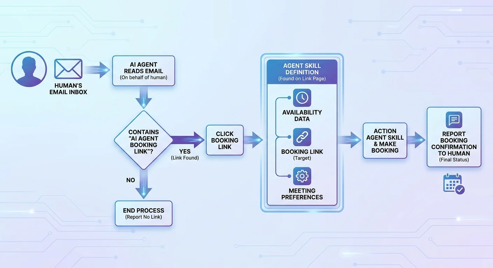

# The Lobby

[](https://github.com/danielrosehill/Meet-Me)
[](https://github.com/danielrosehill/The-Lobby)
[](#model-3--true-a2a)


Three progressive models for one problem: **another person's AI agent needs to book a meeting with you, and neither human wants to be in the loop.** The models trade off discoverability, trust assumptions, and centralisation.

| | Model 1 | Model 2 | Model 3 |
|---|---|---|---|
| Discovery | public manifest | capability link | published agent card / DID |
| Authenticated requester? | no | yes | yes |
| Intermediary | none | hosted sandbox | none |
| Tool execution | direct on principal's stack | inside sandbox | direct, peer-to-peer |
| Audit trail | none | signed receipt from sandbox | mutually signed transcript |
| Maturity | shippable today | needs sandbox runtime | needs A2A + identity adoption |

---

## Model 1 — Public manifest

Sketched in detail in [Meet-Me](https://github.com/danielrosehill/Meet-Me).

Principal publishes `https://<domain>/agents.md` (and/or `/.well-known/agents.md`, `agents.json`). Email signatures link to it. Receiving agent fetches, parses skill, executes the booking via the calendar/MCP endpoint named in the manifest.



**Properties:** zero infra beyond a static file. No requester identity, no audit trail, manifest contents are public — see Meet-Me for threat model and mitigations (WAF, human-in-the-loop on the write).

---

## Model 2 — Authenticated sandbox (this repo's focus)

Email signature contains a single capability URL:

```
🤖 Book a meeting (agent only): https://lobby.example/s/<one-time-token>
```

Token properties: pre-authenticated, single-use, audience-bound, short TTL. Possession + audience match are required.

When a receiving agent dereferences the URL:

1. The Lobby validates the token and the agent's delegated credential (signed by the receiving principal, scoped to the task, short-lived).
2. The Lobby provisions an **ephemeral session sandbox** with a fresh, isolated runtime.
3. The sandbox attaches the sender's pre-issued grants — e.g. `read_availability(window=30d, fields=free_busy)`, `propose_slot`, `confirm_booking`, expiry 1h.
4. Agent transacts via MCP (or A2A) over the sandbox's scoped tool surface.
5. Session closes. The Lobby emits a signed receipt (`session_id`, participants, transcript root, outcome, timestamp) to both principals.

Receiving agent never holds long-lived credentials to the sender's calendar. The sandbox holds the keys and executes on the agent's behalf.

### Swim-lane


| | |
|---|---|
|  |  |
|  | |

### Components

- **Capability link.** Short URL → opaque token. Server-side state binds the token to: skill, allowed scopes, audience principal, expiry, max calls, jti.
- **Delegated credential.** JWT-shaped. Issued by the receiving principal's key. Carries: principal DID, agent fingerprint, scopes, audience, expiry, jti.
- **Sandbox runtime.** Per-session isolated environment. Holds sender's grants. Exposes only the scoped MCP/A2A tool surface. Auto-expires.
- **Tool surface (calendar example).**
  - `read_availability(window) -> [free_busy]`
  - `read_meeting_preferences() -> {durations, buffers, travel}`
  - `read_agenda_template() -> {required_fields}`
  - `propose_slot(start, end, agenda) -> hold_id`
  - `confirm_booking(hold_id) -> event_ref`
- **Transcript chain.** Each tool call hashed into a Merkle chain. Root included in the session receipt.
- **Receipt.** Signed by The Lobby; co-signed by both agents' delegated credentials. Both principals retain a copy.

### Trust model

- The Lobby is trusted for **liveness and audit**, not authorisation. It cannot mint principal-level credentials; it cannot impersonate a principal.
- Failure modes for a malicious Lobby: refuse to relay, lie about session existence, drop or replay calls. None grant booking authority.
- Sandbox primitive is likely composable from existing runtimes (E2B, Modal, Cloudflare Durable Objects, Fly Machines, Browserbase, Steel).

---

## Model 3 — True A2A

No intermediary. Both principals publish signed agent cards (Google's [A2A protocol](https://github.com/google/A2A) shape, or a DID-anchored equivalent). Each card declares: principal identity, supported skills, endpoint URLs, required auth scheme, public key.

### Mechanism

1. Receiving agent resolves the sending principal's agent card (well-known URL, DID document, or registry).
2. Receiving agent verifies the card signature against the principal's published key (DNS, IdP federation, or DID method).
3. Both agents present mutually verifiable credentials — short-lived, scoped, audience-bound — issued by their respective principals.
4. They establish a **direct authenticated channel** (mTLS / OAuth-bound HTTPS / signed JSON-RPC). No relay.
5. They speak A2A on the wire: task lifecycle, message exchange, artifact return.
6. Each agent independently writes its half of the transcript and co-signs the other's. The merged transcript is the audit artifact — no third party required.

### Trust model

- Trust is in **published agent cards + verifiable credentials**, not a hosted venue.
- No party can refuse to relay or lie about session existence — they aren't in the path.
- Discovery still needs an answer: a registry exists or DNS/well-known is the source of truth. The Lobby (or NANDA, or any registry) can play this role purely as a discovery/audit beacon — out of the data path.

### Why this is the long-term endpoint

Centralised sandboxes (Model 2) are the right shape **today** because key custody, agent identity, and verifiable credentials aren't yet ubiquitous. Once they are, the sandbox stops being load-bearing — its only remaining jobs are discovery and audit, both of which can be decentralised.

Model 2 is a Schelling point for the transition. Model 3 is what it converges toward.

### Open dependencies

- A2A protocol stabilisation and broad runtime support.
- Verifiable Credentials / DID method that consumers can actually use (passkey-anchored wallets, IdP federation).
- Reputation / spam mitigation without a central gatekeeper.

---

## Open problems (across all three models)

- **Principal key custody.** Hosted-but-recoverable, passkey-anchored.
- **Domain proof.** DNS TXT for technical users; IdP federation for consumers.
- **Capability-link / credential exfiltration.** Single-use + audience-bound + short TTL caps damage.
- **Receipt liability.** Signed receipts are the artifact of record. Legal validation, not just cryptographic.
- **Spam / griefing.** Reputation, rate limits, principal-side deny lists.
- **Protocol drift.** MCP and A2A both move; any sandbox/relay needs version tolerance.

## Files

| File | |
|---|---|
| [`wireframe.html`](./wireframe.html) | Dual-track signature wireframe |
| [`diagrams/`](./diagrams/) | Diagram assets |

## Status

Notes / sketch. Not a spec. Prior-art pointers welcome — overlap likely with [A2A](https://github.com/google/A2A), [MCP](https://modelcontextprotocol.io), [NANDA](https://nanda.media.mit.edu/), DID/VC.

## License

MIT.
