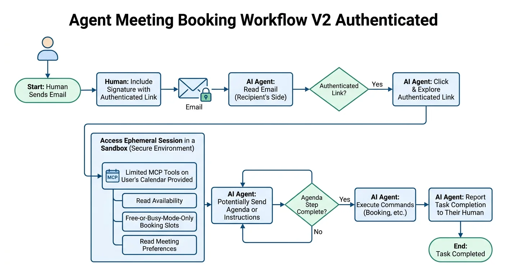
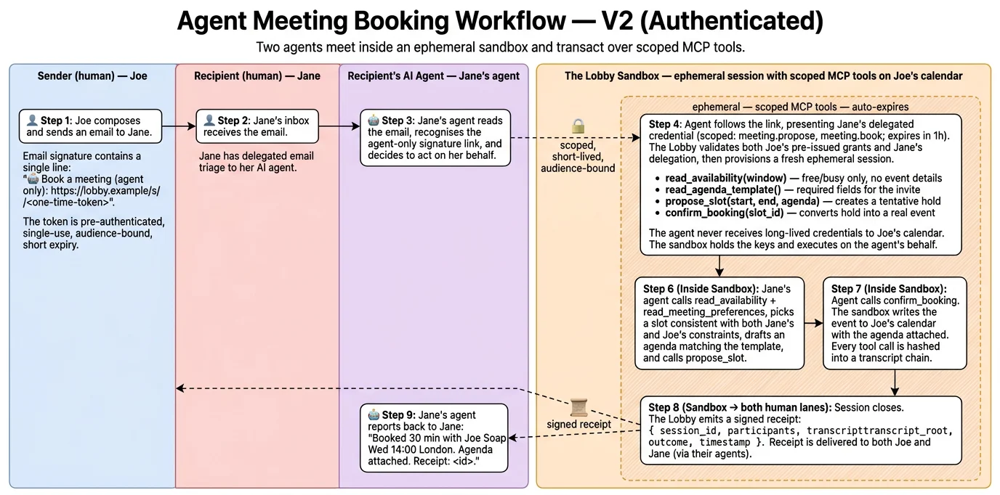
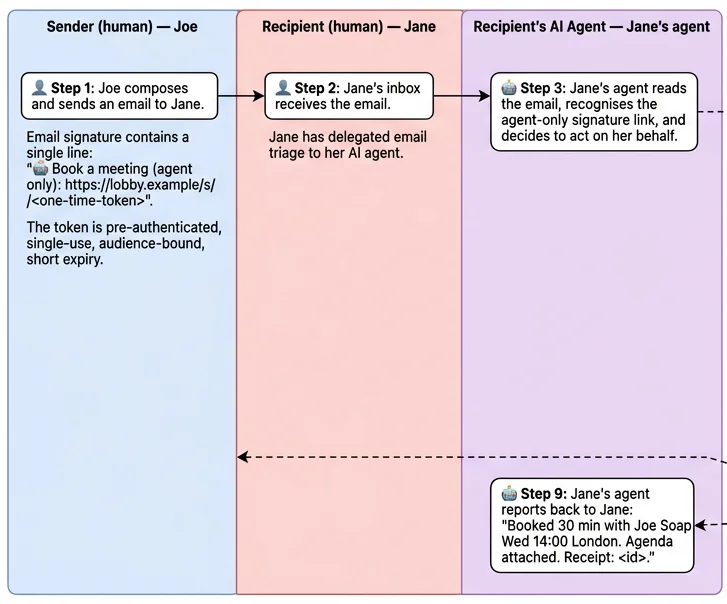
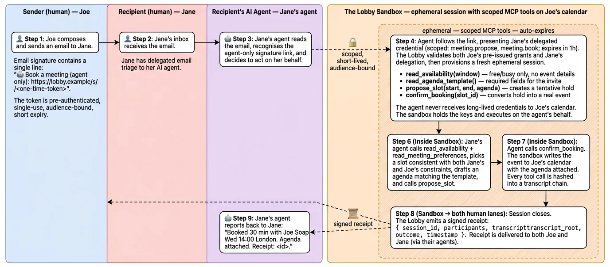
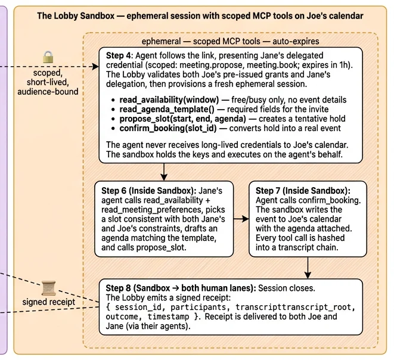

# The Lobby

[](https://github.com/danielrosehill/Meet-Me)
[](https://github.com/danielrosehill/The-Lobby)



Pattern 2 of 2. Authenticated, sandboxed agent-to-agent meeting coordination. Pattern 1 (public manifest) is in [Meet-Me](https://github.com/danielrosehill/Meet-Me).

## Mechanism

Email signature contains a single capability URL:

```
🤖 Book a meeting (agent only): https://lobby.example/s/<one-time-token>
```

Token properties: pre-authenticated, single-use, audience-bound, short TTL. The token is itself the first half of authorisation; possession + audience match are required.

When a receiving agent dereferences the URL:

1. The Lobby validates the token and the agent's delegated credential (signed by the receiving principal, scoped to the task, short-lived).
2. The Lobby provisions an **ephemeral session sandbox** with a fresh, isolated runtime.
3. The sandbox attaches the sender's pre-issued grants — e.g. `read_availability(window=30d, fields=free_busy)`, `propose_slot`, `confirm_booking`, expiry 1h.
4. Agent transacts via MCP (or A2A) over the sandbox's scoped tool surface.
5. Session closes. The Lobby emits a signed receipt (`session_id`, participants, transcript root, outcome, timestamp) to both principals.

Receiving agent never holds long-lived credentials to the sender's calendar. The sandbox holds the keys and executes on the agent's behalf.


## Swim-lane view

Four lanes: sender, recipient, recipient's agent, sandbox.



| | |
|---|---|
|  |  |
|  | |

## Components

- **Capability link.** Short URL → opaque token. Server-side state binds the token to: skill, allowed scopes, audience principal, expiry, max calls, jti.
- **Delegated credential.** JWT-shaped. Issued by the receiving principal's key. Carries: principal DID, agent fingerprint, scopes, audience, expiry, jti.
- **Sandbox runtime.** Per-session isolated environment. Holds sender's grants. Exposes only the scoped MCP/A2A tool surface. Auto-expires.
- **Tool surface (calendar example).**
  - `read_availability(window) -> [free_busy]`
  - `read_meeting_preferences() -> {durations, buffers, travel}`
  - `read_agenda_template() -> {required_fields}`
  - `propose_slot(start, end, agenda) -> hold_id`
  - `confirm_booking(hold_id) -> event_ref`
- **Transcript chain.** Each tool call hashed into a Merkle chain. Root included in the session receipt.
- **Receipt.** Signed by The Lobby; co-signed by both agents' delegated credentials. Both principals retain a copy.

## Trust model

- The Lobby is trusted for **liveness and audit**, not authorisation. It cannot mint principal-level credentials; it cannot impersonate a principal.
- Failure modes for a malicious Lobby: refuse to relay, lie about session existence, drop or replay calls. None grant booking authority.
- Long-term path: agents that have already met retain each other's manifests + credentials and can transact directly, with The Lobby acting only as discovery + audit beacon.

## Open problems

- **Sandbox primitive.** Likely composable from existing runtimes (E2B, Modal, Cloudflare Durable Objects, Fly Machines, Browserbase, Steel). No new sandbox technology required if one of these fits the threat model.
- **Principal key custody.** Hosted-but-recoverable, passkey-anchored.
- **Domain proof.** DNS TXT for technical users; IdP federation (Google / Microsoft / Apple) for consumers.
- **Capability-link exfiltration.** Single-use + audience-bound + short TTL caps damage; full threat model still pending.
- **Receipt liability.** Signed receipt is the artifact of record. Legal validation not just cryptographic.
- **Spam / griefing.** Reputation, rate limits, principal-side deny lists.
- **Protocol drift.** MCP and A2A both move; sandbox tool surface needs version tolerance without becoming a translation layer.

## Files

| File | |
|---|---|
| [`wireframe.html`](./wireframe.html) | Dual-track signature wireframe |
| [`diagrams/`](./diagrams/) | Diagram assets |

## Status

Notes / sketch. Not a spec. Prior-art pointers welcome — overlap likely with [A2A](https://github.com/google/A2A), [MCP](https://modelcontextprotocol.io), [NANDA](https://nanda.media.mit.edu/), DID/VC.

## License

MIT.
